# Отчёт: аномалии изоляции в SQL

**СУБД:** PostgreSQL (локально)  
**Инструмент:** pgAdmin, два окна Query Tool  
**База данных:** `isolation_practice`  
**Таблицы:** `accounts (id, holder_name, balance)`, `products (id, name, price, category)`

---

## 1. Выбранные аномалии

| № | Аномалия | Уровень изоляции | Результат |
|---|----------|------------------|-----------|
| 1 | Dirty read (грязное чтение) | `READ UNCOMMITTED` | **Не воспроизведена** — встроенная защита PostgreSQL |
| 2 | Non-repeatable read (неповторяющееся чтение) | `READ COMMITTED` | Воспроизведена |
| 3 | Phantom read (фантомное чтение) | `READ COMMITTED` | Воспроизведена |
| 4 | Lost update (потерянное обновление) | `READ COMMITTED` | Воспроизведена |

Скрипты создания данных: `sql/01-schema.sql`, `sql/02-seed-data.sql`. Сброс между опытами: `sql/00-reset.sql`.

### Подготовка базы

Создана БД `isolation_practice`, загружены тестовые данные: 2 счёта в `accounts`, 4 товара в `products`.

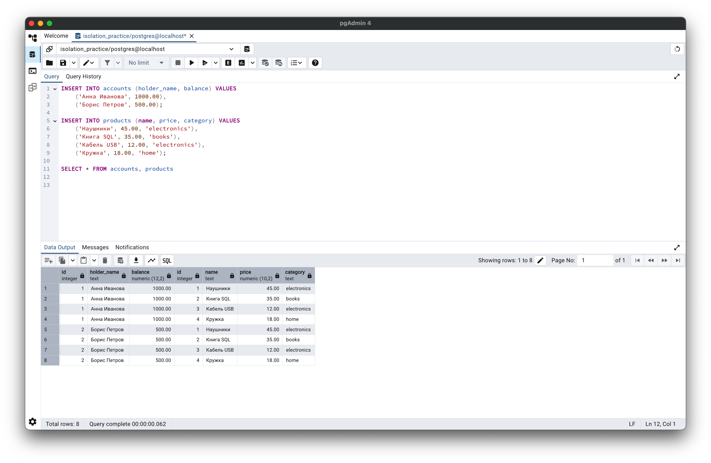

---

## 2. Dirty read (грязное чтение)

### 2.1. Суть аномалии

Транзакция **B** читает строку, которую транзакция **A** уже изменила, но ещё **не закоммитила**. Если A делает `ROLLBACK`, B опиралась на данные, которых в БД «как бы не было».

### 2.2. Шаги воспроизведения (попытка)

**Сессия 1:**

```sql
BEGIN;
SET TRANSACTION ISOLATION LEVEL READ UNCOMMITTED;
UPDATE accounts SET balance = 5000.00 WHERE id = 1;
SELECT id, holder_name, balance FROM accounts WHERE id = 1;
-- COMMIT не выполняется
```

**Сессия 2** (пока С1 открыта):

```sql
BEGIN;
SET TRANSACTION ISOLATION LEVEL READ UNCOMMITTED;
SELECT id, holder_name, balance FROM accounts WHERE id = 1;
```

**Сессия 1:** `ROLLBACK;`

### 2.3. Полученный результат

| Сессия | balance для id=1 | Комментарий |
|--------|------------------|-------------|
| С1 | 5000.00 | Видит своё незакоммиченное изменение |
| С2 | **1000.00** | Не видит 5000 — грязного чтения **нет** |

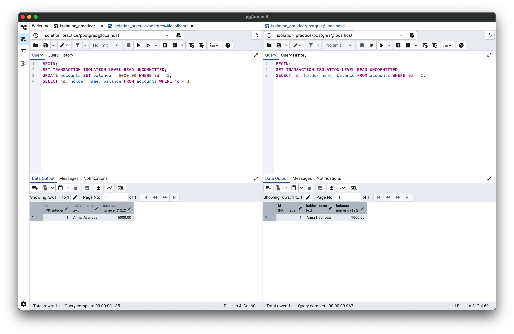

На скриншоте: в С1 после `UPDATE` — balance **5000**, транзакция открыта; в С2 при том же уровне `READ UNCOMMITTED` — balance **1000** (исходное значение).

**Вывод:** в PostgreSQL dirty read **не возникает**. СУБД использует MVCC: другие транзакции не читают незакоммиченные версии строк. Уровень `READ UNCOMMITTED` в PostgreSQL документированно работает как **`READ COMMITTED`** — это встроенная защита, а не ошибка сценария.

### 2.4. Как избежать

В PostgreSQL отдельно настраивать не нужно — защита заложена в архитектуре. В СУБД, где `READ UNCOMMITTED` реально допускает грязное чтение, помогает переход на **`READ COMMITTED`** или выше.

---

## 3. Non-repeatable read (неповторяющееся чтение)

### 3.1. Суть аномалии

В одной транзакции два одинаковых `SELECT` по одной строке дают **разные значения**, потому что другая транзакция успела изменить строку и сделать `COMMIT` между чтениями.

### 3.2. Шаги воспроизведения

1. **С1:** `BEGIN`, `READ COMMITTED`, `SELECT` по `accounts.id = 1`.
2. **С2:** `UPDATE accounts SET balance = 2000.00 WHERE id = 1`, `COMMIT`.
3. **С1:** повторный `SELECT` по той же строке, `COMMIT`.

### 3.3. Полученный результат

| Чтение | balance (id=1) |
|--------|----------------|
| Первое (С1) | 1000.00 |
| Второе (С1) | 2000.00 |

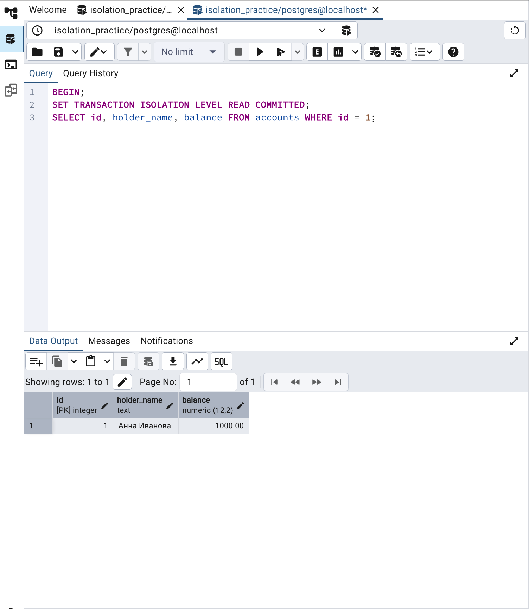

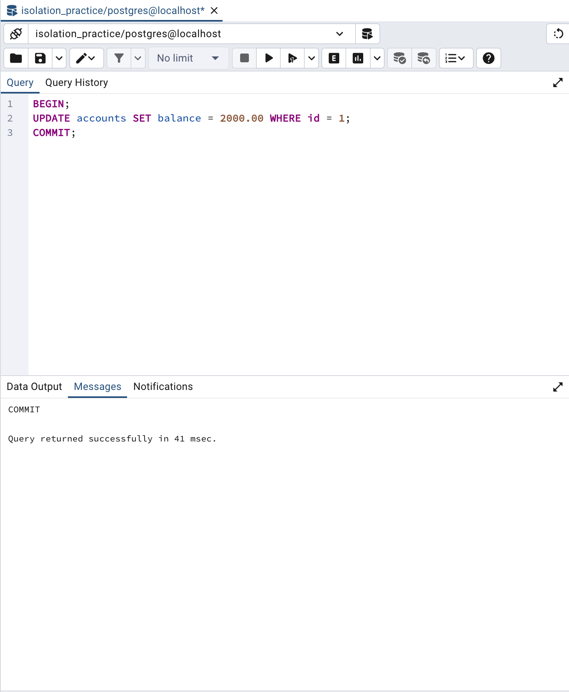

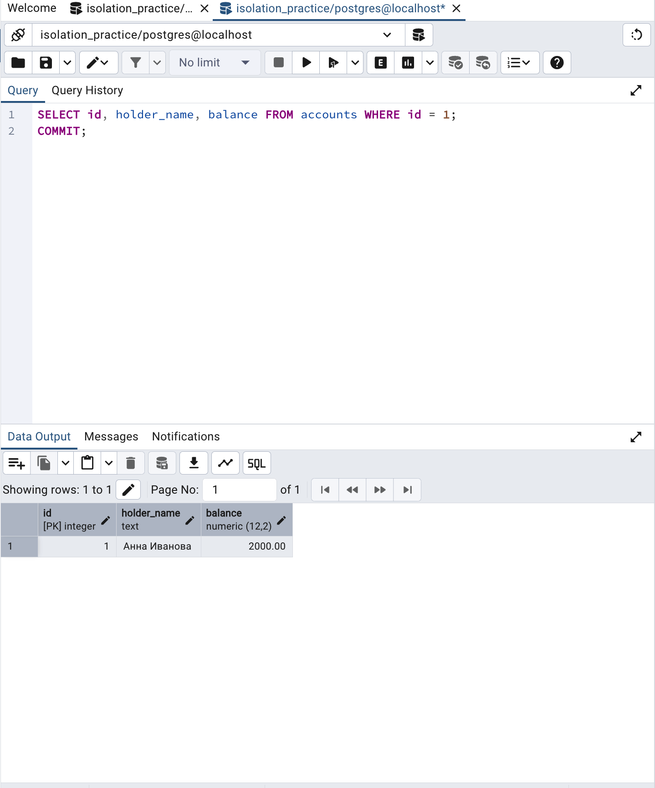

В одной транзакции С1 значение изменилось с **1000** на **2000** после коммита в С2 — это non-repeatable read.

### 3.4. Как избежать

Установить уровень **`REPEATABLE READ`** или **`SERIALIZABLE`**: PostgreSQL фиксирует снимок данных на начало транзакции, повторный `SELECT` вернёт **1000**.

```sql
BEGIN;
SET TRANSACTION ISOLATION LEVEL REPEATABLE READ;
SELECT balance FROM accounts WHERE id = 1;
-- другая сессия: UPDATE ... COMMIT
SELECT balance FROM accounts WHERE id = 1;  -- снова 1000
COMMIT;
```

---

## 4. Phantom read (фантомное чтение)

### 4.1. Суть аномалии

Два одинаковых запроса с условием в одной транзакции возвращают **разное число строк** — другая транзакция вставила подходящие строки и закоммитила их между чтениями.

### 4.2. Шаги воспроизведения

1. **С1:** `BEGIN`, `READ COMMITTED`, `SELECT COUNT(*) FROM products WHERE price < 50`.
2. **С2:** `INSERT` товара «Планшет» (29.99), `COMMIT`.
3. **С1:** повторный `COUNT(*)`, `COMMIT`.

> Для демонстрации аномалии нужен именно **`READ COMMITTED`**. На `REPEATABLE READ` в PostgreSQL фантомов не будет.

### 4.3. Полученный результат

| Чтение | cnt_cheap (`price < 50`) |
|--------|--------------------------|
| Первое (С1) | 4 |
| Второе (С1) | 5 |

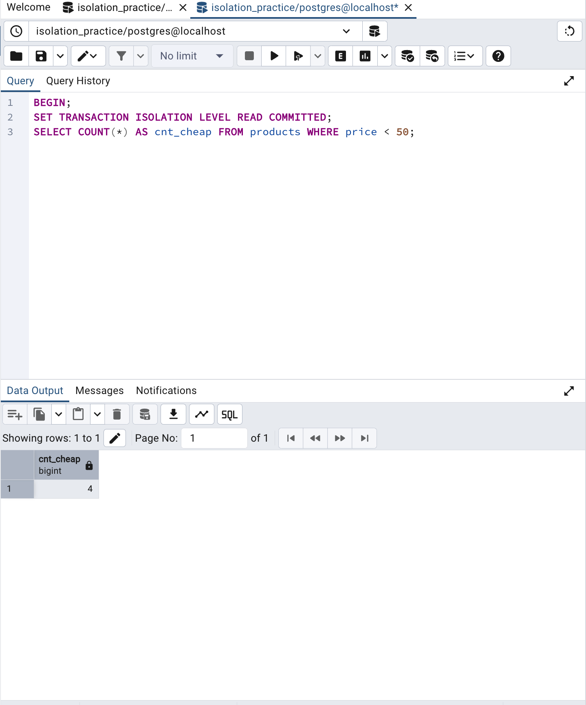

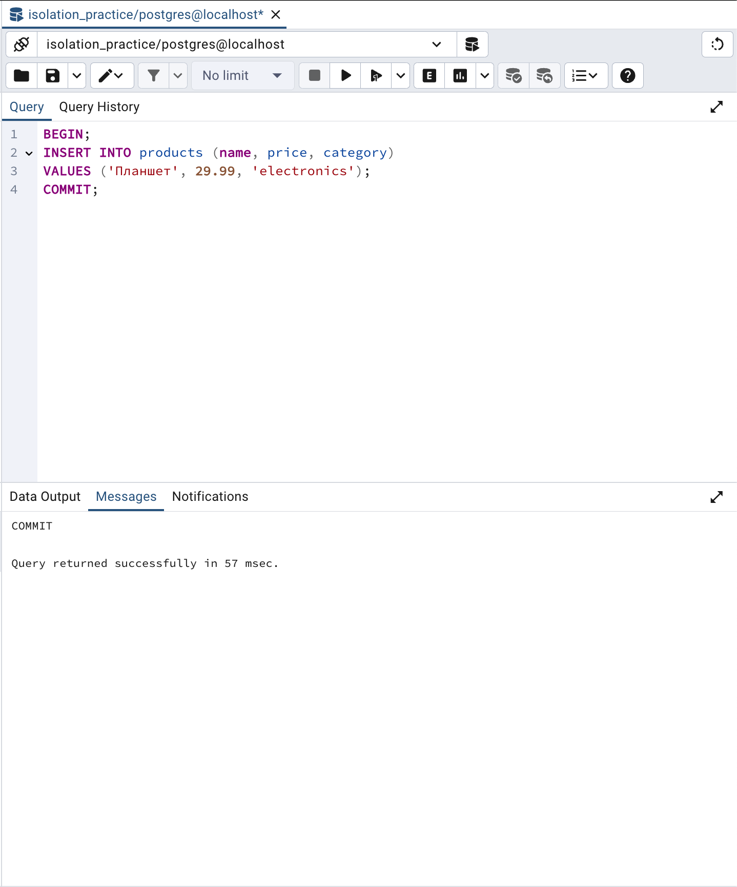

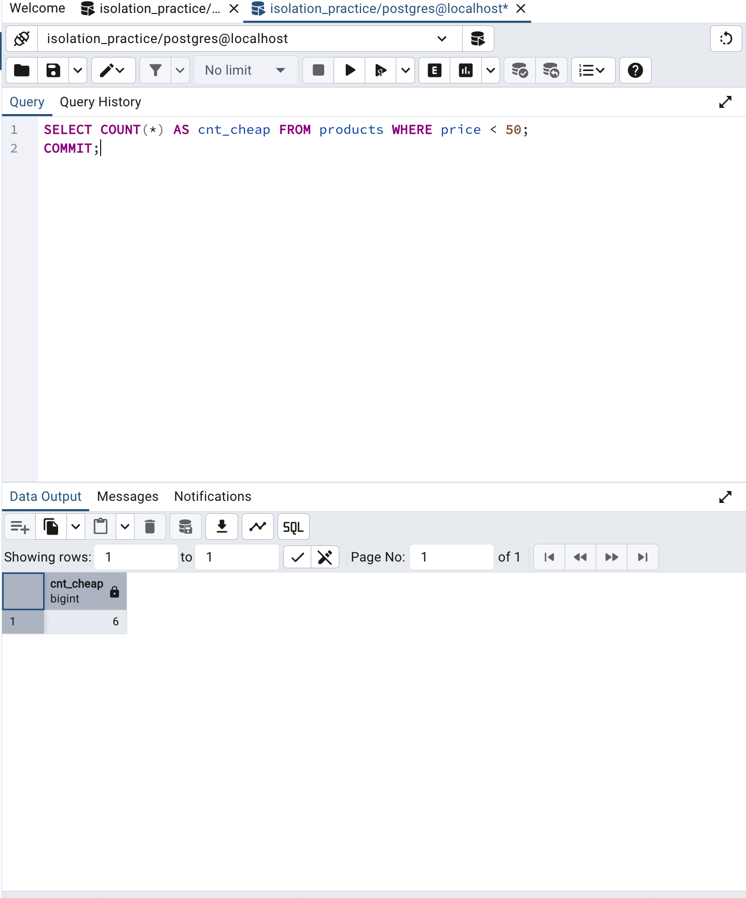

Появилась «фантомная» строка — товар, которого не было при первом запросе.

### 4.4. Как избежать

Уровень **`REPEATABLE READ`** (в PostgreSQL — snapshot isolation): оба `COUNT` дадут **4**.

```sql
BEGIN;
SET TRANSACTION ISOLATION LEVEL REPEATABLE READ;
SELECT COUNT(*) FROM products WHERE price < 50;
-- INSERT + COMMIT в другой сессии
SELECT COUNT(*) FROM products WHERE price < 50;  -- снова 4
COMMIT;
```

---

## 5. Lost update (потерянное обновление)

### 5.1. Суть аномалии

Две транзакции читают одно значение, каждая вычисляет новый balance «от старого» и записывает результат. **Последний `COMMIT` перезаписывает** обновление другой транзакции (паттерн read–modify–write без блокировки).

### 5.2. Шаги воспроизведения

Счёт `accounts.id = 2`, стартовый balance **500**.

1. **С1:** `BEGIN`, `READ COMMITTED`, `SELECT` → 500.
2. **С2:** `SELECT` → 500, `UPDATE` balance = **600** (+100), `COMMIT`.
3. **С1:** `UPDATE` balance = **550** (+50 от прочитанных 500), `COMMIT`.
4. Проверка: `SELECT` по id=2.

### 5.3. Полученный результат

| Этап | balance (id=2) |
|------|----------------|
| Оба SELECT | 500.00 |
| После COMMIT С2 | 600.00 |
| После COMMIT С1 | **550.00** |
| Ожидалось при сложении +50 и +100 | **650.00** |

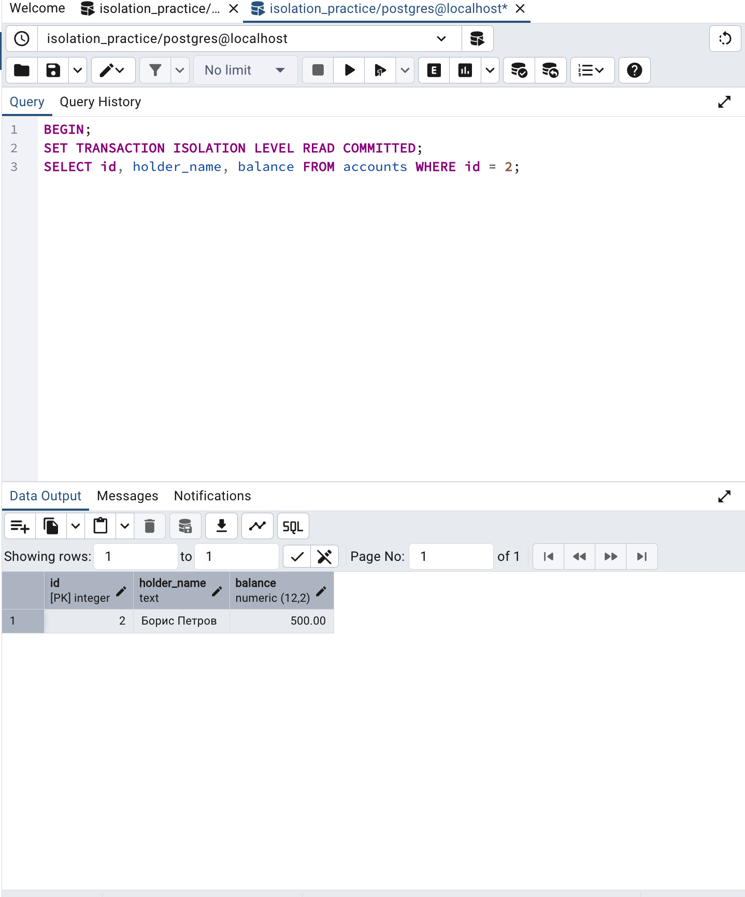

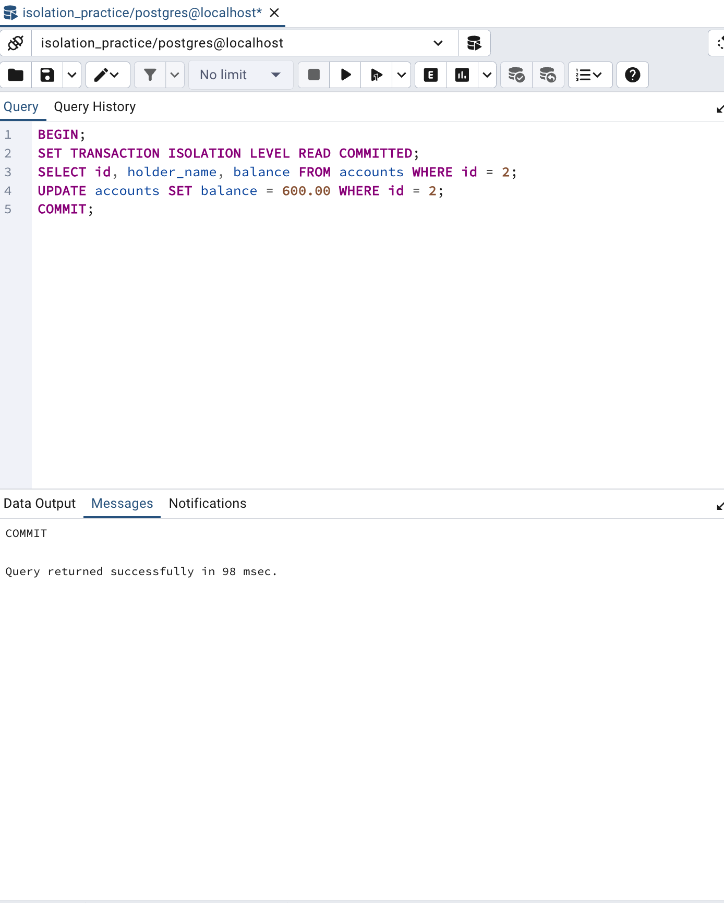

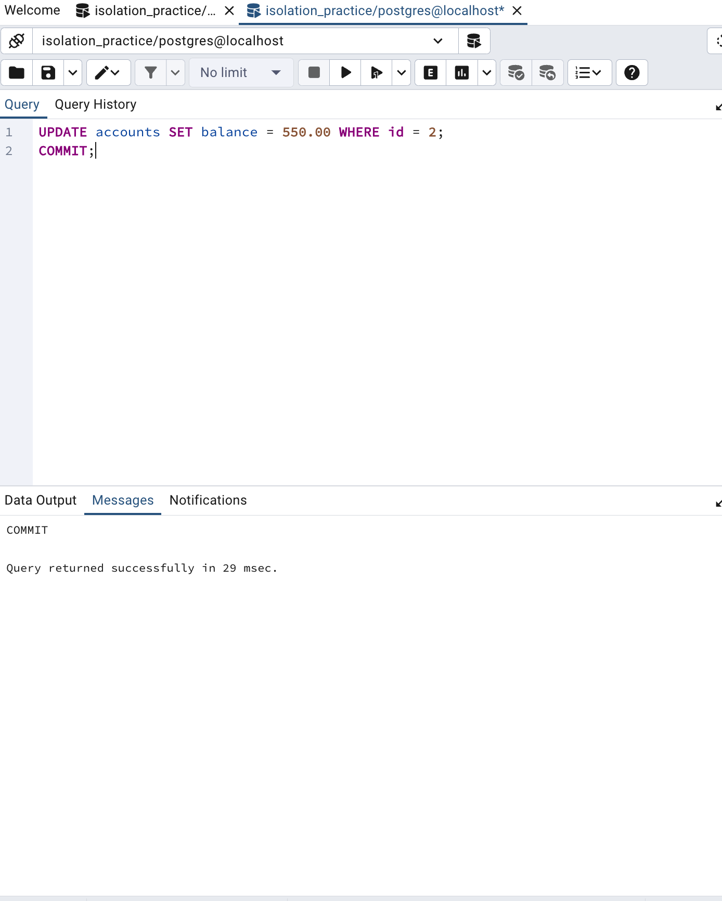

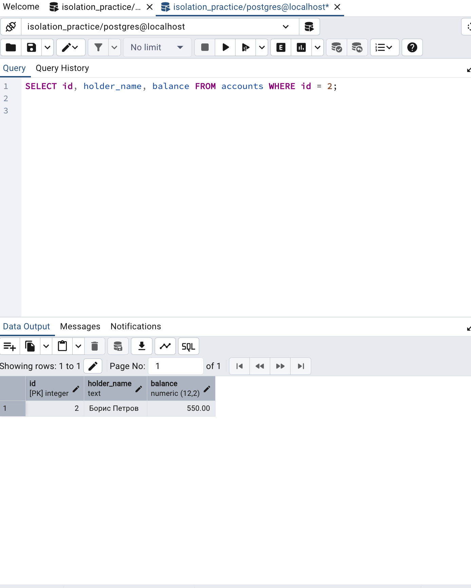

Итог **550** вместо **650** — потеряно увеличение на **100** из сессии 2 (lost update).

### 5.4. Как избежать

1. **`SELECT ... FOR UPDATE`** — вторая транзакция ждёт, пока первая не завершится:

```sql
BEGIN;
SELECT balance FROM accounts WHERE id = 2 FOR UPDATE;
UPDATE accounts SET balance = 550.00 WHERE id = 2;
COMMIT;
```

2. Уровень **`SERIALIZABLE`** — конфликтующая транзакция получит ошибку сериализации.

3. Атомарное обновление без чтения в приложение:

```sql
UPDATE accounts SET balance = balance + 50 WHERE id = 2;
```

---

## 6. Общий вывод

Практика показала поведение параллельных транзакций в PostgreSQL при уровне **`READ COMMITTED`**:

- **Dirty read** в PostgreSQL **не воспроизводится** — СУБД по умолчанию защищает от чтения незакоммиченных данных (MVCC).
- **Non-repeatable read**, **phantom read** и **lost update** **успешно воспроизведены** в двух сессиях pgAdmin.
- Для предотвращения аномалий используются более строгие уровни изоляции (`REPEATABLE READ`, `SERIALIZABLE`), блокировки `FOR UPDATE` и атомарные операции `UPDATE ... SET col = col + ...`.

---

## Приложение: файлы проекта

| Файл | Назначение |
|------|------------|
| `sql/00-create-database.sql` | Создание БД |
| `sql/01-schema.sql` | Таблицы |
| `sql/02-seed-data.sql` | Тестовые данные |
| `sql/00-reset.sql` | Сброс между опытами |
| `sql/anomalies/01-dirty-read-postgres.sql` | Сценарий dirty read |
| `sql/anomalies/02-non-repeatable-read.sql` | Сценарий non-repeatable read |
| `sql/anomalies/03-phantom-read.sql` | Сценарий phantom read |
| `sql/anomalies/04-lost-update.sql` | Сценарий lost update |
