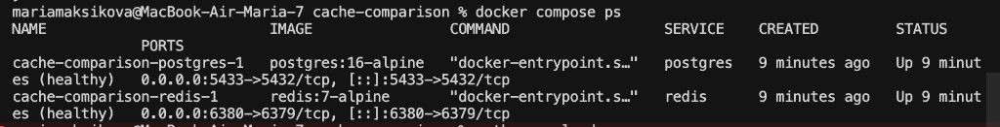
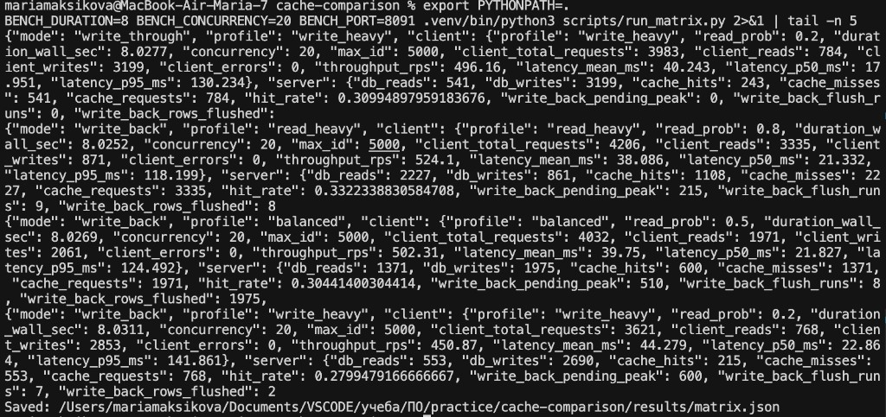
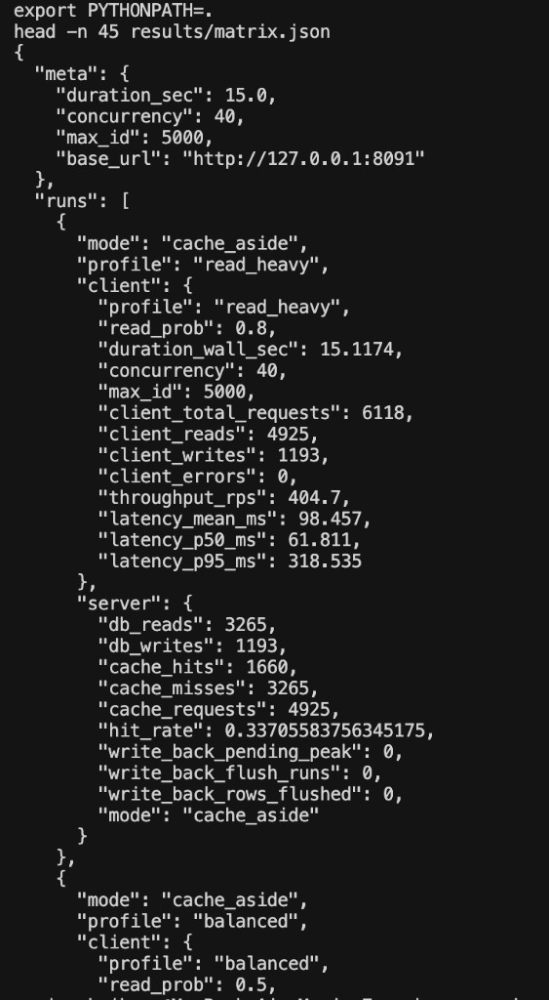
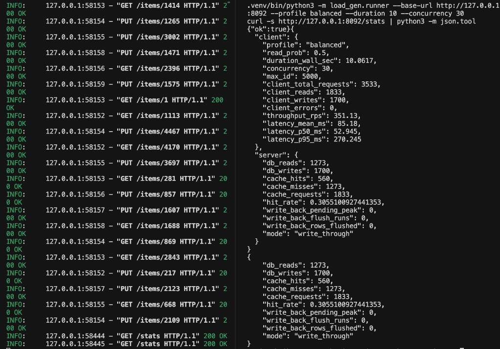

# Практика: сравнение типов кеширования

## Цель

Сравнить три стратегии кеширования в одинаковых условиях:

- `Cache-Aside` (Lazy Loading)
- `Write-Through`
- `Write-Back`

## Стенд

- **Application / Load Generator:** FastAPI + собственный асинхронный генератор нагрузки
- **Cache:** Redis 7
- **DB:** PostgreSQL 16
- **Набор данных:** 5000 ключей (`id=1..5000`)
- **Профили нагрузки:** `80/20`, `50/50`, `20/80` (read/write)

## Результаты

| Strategy          | Scenario             | RPS        | Avg Latency   | Hit Rate   | DB Reads | DB Writes |
| ----------------- | -------------------- | ---------- | ------------- | ---------- | -------- | --------- |
| **Cache-Aside**   | 80% Read / 20% Write | 404.70     | 98.46 ms      | 33.71%     | 3265     | 1193      |
| **Cache-Aside**   | 50% Read / 50% Write | 375.18     | 106.25 ms     | 21.07%     | 2248     | 2822      |
| **Cache-Aside**   | 20% Read / 80% Write | 359.20     | 111.14 ms     | 7.90%      | 1026     | 4294      |
| **Write-Through** | 80% Read / 20% Write | **480.83** | **83.00 ms**  | 46.94%     | 3070     | 1455      |
| **Write-Through** | 50% Read / 50% Write | 394.22     | 101.28 ms     | 41.16%     | 1728     | 2997      |
| **Write-Through** | 20% Read / 80% Write | 336.61     | 118.43 ms     | 38.88%     | **610**  | 4091      |
| **Write-Back**    | 80% Read / 20% Write | 342.07     | 116.67 ms     | 37.59%     | 2563     | 1026      |
| **Write-Back**    | 50% Read / 50% Write | **486.30** | **82.09 ms**  | **47.18%** | 1927     | 3510      |
| **Write-Back**    | 20% Read / 80% Write | **398.86** | **100.12 ms** | **44.01%** | 631      | 4543      |

## Write-Back: накопление отложенных записей

| Scenario             | Pending Peak | Flush Runs | Rows Flushed | Pending after final flush |
| -------------------- | ------------ | ---------- | ------------ | ------------------------- |
| 80% Read / 20% Write | 137          | 15         | 1026         | 0                         |
| 50% Read / 50% Write | 482          | 13         | 3510         | 0                         |
| 20% Read / 80% Write | **781**      | 13         | 4543         | 0                         |

## Анализ

1. **Read-heavy (80/20).** Лучший профиль у `Write-Through`: максимальный RPS и минимальная средняя задержка. `Cache-Aside` заметно уступает по hit rate из-за постоянной инвалидации кеша после записей.
2. **Balanced (50/50).** Лидирует `Write-Back`: самый высокий RPS, минимальная задержка и лучший hit rate. В этом режиме отложенная запись даёт заметный выигрыш по производительности.
3. **Write-heavy (20/80).** `Write-Back` снова быстрее остальных и держит высокий hit rate. При этом наблюдается пик очереди отложенных операций (`781`), что отражает компромисс между скоростью и моментальной консистентностью.
4. **Нагрузка на БД.** Наименьшие чтения из БД в write-intensive сценариях у `Write-Through`/`Write-Back`; `Cache-Aside` сильнее загружает БД чтениями при частых обновлениях.

## Выводы

- **Для чтения:** оптимален `Write-Through`.
- **Для записи и смешанной нагрузки:** наиболее эффективен `Write-Back`.
- **Для строгой синхронной консистентности:** предпочтителен `Write-Through`.
- **Cache-Aside** подходит для сценариев с редкими записями и менее агрессивной конкуренцией обновлений.

## Скриншоты

### Docker compose services

### Matrix run tail

### Matrix JSON head

### Manual balanced stats

